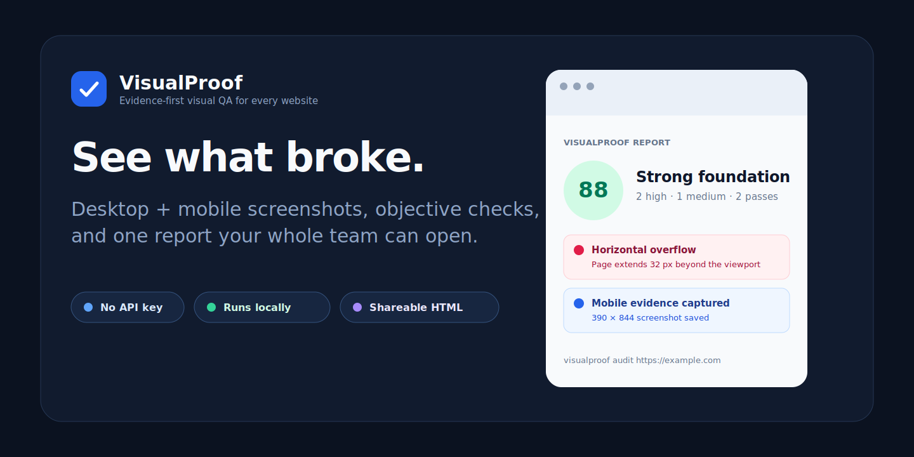
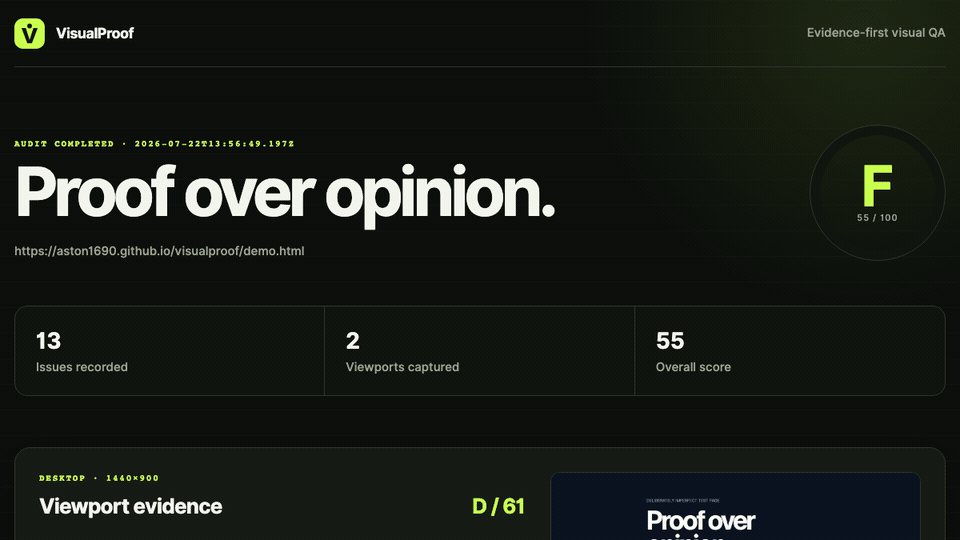

<p align="center">
  
</p>

<p align="center">
  <a href="LICENSE"></a>
  
  <a href="https://github.com/Aston1690/visualproof/stargazers"></a>
</p>

# VisualProof

VisualProof audits what a browser actually renders. It captures desktop and mobile evidence, checks measurable interface failures, and produces a portable HTML report that designers, developers, QA teams, and coding agents can inspect together.

No AI API key. No subjective prompt output. Every issue includes reproducible browser evidence.

[Open the live sample report](https://aston1690.github.io/visualproof/)

<p align="center">
  <a href="https://aston1690.github.io/visualproof/"></a>
</p>

## What it catches

- Missing page titles and meta descriptions
- Missing or duplicated H1 headings
- Images without alternative text
- Horizontal overflow at real viewport widths
- Browser console errors
- Touch targets smaller than 44 × 44 px
- Heading sizes that overwhelm desktop or mobile layouts

VisualProof saves both human-readable and machine-readable output:

```text
visualproof-report/
├── index.html
├── report.json
└── screenshots/
    ├── desktop-<capture-id>.png
    └── mobile-<capture-id>.png
```

## Quick start

```bash
git clone https://github.com/Aston1690/visualproof.git
cd visualproof
npm install
npx playwright install chromium
npm link

visualproof audit https://example.com
```

Audit a local HTML file:

```bash
visualproof audit ./examples/demo/index.html --output visualproof-report
```

Then open `visualproof-report/index.html`.

## Why VisualProof

Many website audits return a score without showing what the browser saw. VisualProof treats evidence as the product:

| | VisualProof |
|---|---|
| Input | Public URL or local HTML file |
| Viewports | Desktop and mobile |
| Evidence | Screenshots plus exact DOM/browser signals |
| Output | Self-contained HTML and structured JSON |
| AI service | Not required |
| Data handling | Runs locally |
| Automation | Deterministic and CI-friendly |

## Scoring

Issues are weighted by impact:

| Severity | Deduction | Examples |
|---|---:|---|
| High | 12 points | Horizontal overflow, console errors, missing H1 |
| Medium | 6 points | Missing metadata, duplicate H1, missing alt text, small touch targets |
| Low | 3 points | Potentially oversized heading |

Scores are intentionally simple and inspectable. The evidence matters more than the letter grade.

## Report design

The generated report is a single HTML file with no external scripts or stylesheets. Desktop and mobile screenshots are embedded directly as PNG data, so the report remains complete when it is moved, attached to an issue, or stored as a CI artifact. Separate PNG files are also retained for direct inspection.

## Use it from code

```js
import { auditTarget } from './src/audit.js';
import { writeReport } from './src/report.js';

const outputDir = 'visualproof-report';
const audit = await auditTarget('https://example.com', outputDir);

await writeReport(audit, outputDir);
```

## Development

```bash
npm install
npx playwright install chromium
npm test
npm run audit:demo
```

VisualProof follows test-driven development. Every new rule should begin with a failing behavior test and include concrete evidence plus documented false-positive risks.

Read [CONTRIBUTING.md](CONTRIBUTING.md), review the [roadmap](ROADMAP.md), or propose a deterministic rule using the issue template.

## Roadmap

- Baseline screenshot comparison and visual diffs
- WCAG color-contrast evidence
- Multi-page audits
- GitHub Action with pull-request summaries
- Configurable severities and ignore annotations
- Spacing-consistency analysis

## Privacy and responsible use

VisualProof opens pages in a local automated browser. Audit only websites you are authorized to access. Generated screenshots can contain sensitive page content; review them before sharing or committing reports.

## License

MIT © Akhil

---

If VisualProof saves you a manual QA pass, consider starring the repository. It helps other designers and developers discover the project.
